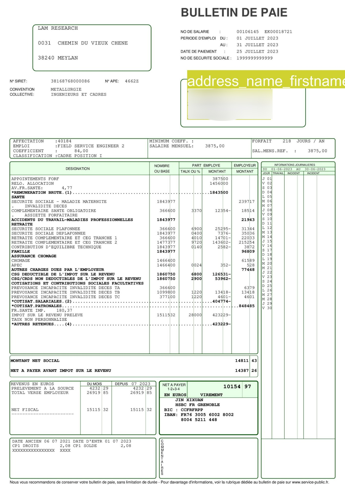

# Payslip Fields Detector

## Contexte: 
Traiter les bulletins de salaire  

## Besoins & Objectifs:
- Détecter et typer les 13 champs suivants: period, net_salary, nirpp_number, siret_number, address_name_firstname, net_a_payer,date_entrée_dans_l'entreprise, cumul_salaire_de_l'année, nom_de_l'entreprise, adresse_de_l'entreprise, nature_du contrat(CDD CDI), Taux_personnalisé, Base_(net_imposable) 


## Contraintes:

- Il y a diverses formes de bulletins de salaire.
- Les champs à reconnaitre se trouvent à des emplacements variés dans le document
- La qualité des données est très variée 


## Installation
Suivez les étapes suivantes :

    git clone https://git.jouve-hdi.com/MHBO/payslip_fields_detector-gpl-3-0-license.git # cloning
    cd payslip_fields_detector-gpl-3-0-license                           # change dir to git repo
    python3.8 -m venv payslip_env                                        # creating a virtual environment
    source payslip_env/bin/activate                                      # activate the environment
    pip install --upgrade pip                                            # upgrade pip package
    pip install -r requirements.txt                                      # install required dependencies


## Inférence

    python detect.py --weights runs/train/exp/weights/best.pt            # yolo weights
                     --source images-test/                                # directory
                     --save-txt                                           # Save results in a txt file and json file
                     --save-crop                                          # save cropped prediction boxes

## Résultat

Output image :



Output txt file :

```
4 0.663434 0.211694 0.241871 0.0645161

```

Output json file :

```
[{"label": "address_name_firstname", "bounding_box": [[951, 445], [1375, 605]]}]

```
- Chaque image a un fichier texte et un fichier json avec le même nom que le fichier image
- À l'intérieur du fichier texte, chaque ligne décrit uniquement un objet et se compose du numéro de classe, du centre de l'objet en x, du centre de l'objet en y, de la largeur de l'objet et de la hauteur de l'objet.
- À l'intérieur du fichier json, chaque ligne décrit uniquement un objet et se compose du label de classe, et du coordonnées bbox de l'objet.

Nous avons traité le 5 ème champ de la liste suivantes (des traitements en cours pour le reste des champs) :

``` 
{'period': 0,
'net_salary': 1,
'nirpp_number': 2,
'siret_number': 3,
'address_name_firstname': 4,
'net_a_payer': 5,
'date_entrée_dans_lentreprise': 6,
'cumul_salaire_de_lannée': 7,
'nom_de_lentreprise': 8,
'adresse_de_lentreprise': 9,
'nature_du contrat(CDD/CDI)': 10,
'Taux_personnalisé': 11,
'Base_(net_imposable)': 12
}

```

# Auteur

Mohamed Boukir <mboukir@luminess.eu>